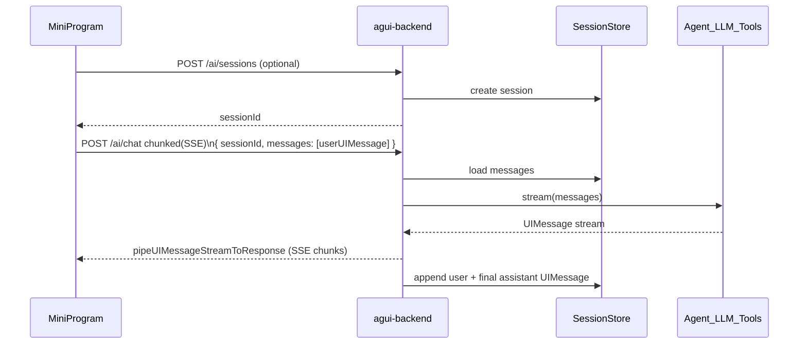

# AI 聊天窗（真流式 + 后端会话）— design spec

**Date:** 2026-04-10  
**Status:** Approved for implementation planning  
**Context:** WeChat mini-program `fresh-weather` (client under `client/`). Agent backend: NestJS `agui-backend` at `D:\develop-work\github\ai-agent-course-code\agui-backend`, already exposing `POST /ai/chat` with LangChain `createAgent` (e.g. `WEB_SEARCH_TOOL`) and `pipeUIMessageStreamToResponse` (Vercel AI SDK UIMessage stream).

---

## 1. Goals

- Add a **chat page** (WeChat / 豆包风格：消息列表 + 底部输入)，用户体验为 **真流式**（边生成边展示，含工具调用过程中的状态反馈）。
- **会话与多轮历史由后端持久化**（小程序不依赖本地作为唯一数据源）；前端可缓存 `sessionId` 以便重返同一会话。
- **分类型渲染**：与后端 UIMessage `parts` 语义对齐（`text`、工具调用/结果等待办映射到不同气泡或附加卡片），避免把结构化事件当纯字符串堆砌。
- **安全**：小程序只请求自有后端；模型 Key 与工具凭据仅存后端。

---

## 2. Locked product / technical decisions

| Topic | Decision |
|-------|----------|
| 会话存储 | **后端**（选项 3）：每条会话 `sessionId`，消息列表持久化；客户端携带 `sessionId` 发下一轮。 |
| 流式 | **真流式**：HTTP **chunked** 消费后端 **UIMessage SSE**（与现有 `pipeUIMessageStreamToResponse` 一致），**不做**「整段 JSON 轮询冒充流式」作为默认路径。 |
| 传输 | **首选** `wx.request` + `enableChunked: true` + `onChunkReceived` 解析 SSE；若实测超时或基础库限制，**再**评估 WSS 网关复用同一事件模型。 |
| 历史合并 | **推荐**：请求体只传 **本轮用户 UIMessage**（或最后一条），服务端 `load(sessionId)` 拼接历史再调用现有 `AiService.stream`；响应结束后将 **本轮 user + 完整 assistant UIMessage** 写回存储。 |
| 流中断 | MVP：失败可提示重试；**可不**持久化半条 assistant（避免脏数据）；增强项另 spec。 |

---

## 3. Architecture

- **agui-backend**：在现有 `AiModule` 上增加 **会话模块**（创建会话、按 `sessionId` 读写消息列表）；`POST /ai/chat` 在 stream **结束前**先持久化用户消息（或在与模型交互前写入），**结束后**写入完整助手消息。  
- **fresh-weather**：新页面（建议 **分包**）维护 `sessionId`、消息列表、`streaming` 状态；`requestTask.onChunkReceived` 增量解析并合并到当前 assistant 消息的 `parts`；按 `part.type` 渲染。

---

## 4. Backend API（概念契约）

以下名称可在实现时微调，但语义建议固定：

| Method / path | 用途 |
|---------------|------|
| `POST /ai/sessions` | 创建空会话，返回 `{ sessionId }`（也可由首次 chat 懒创建，二选一，实现计划里定一种）。 |
| `POST /ai/chat` | Body：`sessionId`，`messages` 为用户本轮的 **UIMessage[]**（推荐仅最新 user）。响应：**与现状相同**的 UIMessage 流式响应头/正文（保持 `pipeUIMessageStreamToResponse`）。 |

**鉴权（建议）：** MVP 可用简易 token 或内网；若对接微信，后续可加 `code2Session` 与用户 id 绑定 `sessionId`（不在本 spec 强制）。

**持久化介质：** 由实现计划选用（如 SQLite/PostgreSQL/Redis）；schema 至少包含 `session_id`、`messages_json`（或规范化表）、`updated_at`。

---

## 5. Mini-program client

- **域名**：在公众平台配置 **request 合法域名** 为 agui-backend 的 HTTPS 域名。  
- **超时**：当前 `client/app.json` 中 `networkTimeout.request` 为 **10000ms**；流式长连接场景需在实现中 **调高** 或使用 `wx.request` 支持的更长超时策略，并配合 UI「仍在生成…」。  
- **SSE 解析**：解码 `ArrayBuffer` 为 UTF-8 文本，**缓存不完整行**（处理跨 chunk 的半行）；按 `\n\n` 分割事件，解析 `data:` 行为 JSON。  
- **渲染**：`scroll-view` 自动滚到底；对文本更新做 **节流**（如 50–100ms）减轻 `setData` 压力。  
- **工具态**：凡流中出现工具调用/进行中的 part，展示明确状态（如「正在搜索…」），与豆包/微信里「对方正在输入」类似但不冒充官方 UI。

---

## 6. Non-goals（本阶段）

- 小程序内直连 OpenAI/火山等公网 LLM。  
- 完整 Markdown 生态（可先纯文本 + 简单换行/链接）。  
- 多模态图片消息（除非后端协议已支持且产品明确要）。  

---

## 7. Verification

- **后端**：`curl -N` 对 `/ai/chat` 确认 SSE/UIMessage 事件顺序；带 `sessionId` 多轮后数据库中历史条数正确。  
- **小程序**：真机/开发者工具验证 `enableChunked` 与基础库版本；长回答 + `web_search` 过程中列表持续更新且结束后历史重启应用仍可加载（若实现拉取历史接口，则在计划中补充 `GET` 会话详情）。

---

## 8. Next step

- 在本仓库执行 **writing-plans**：拆分为 `agui-backend`（会话存储 + chat 入参改造）与 `fresh-weather`（页面 + 流式客户端）两步，并注明依赖顺序与联调地址。
